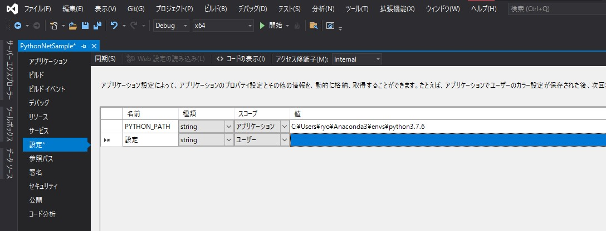

# Pythonnetを使ったNumpyとMatplotlibサンプル
## 前準備
Visual Studioの設定で、Pythonの場所を指定する。
仮想環境でもネイティブ環境で可能。
ただしこのサンプルはPython 3.7を前提に作っているので、注意する。

## 実行

https://user-images.githubusercontent.com/8924325/142749130-4eb8cd38-acf9-4604-974c-e1355c19f4b4.mp4

